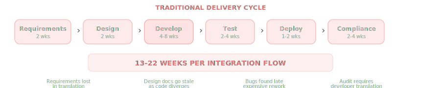

## BiTool

Enterprise Integration & Microservices Platform

{width=70%}

Visual, AI-driven no-code platform for building enterprise integrations,\
microservices, and data pipelines --- from BRD to production.

Confidential --- Executive Briefing

---

## The Challenge

Enterprise integration projects are slow, expensive, and fragile. Whether building microservices, connecting applications, or transforming data --- teams spend more time on handoffs than on building.

{width=70%}

60%

Time Spent\
on Handoffs

3x

Rework Cycles\
per Flow

\$2M+

Avg Cost per\
Integration Project

0

Visibility for\
Compliance

---

## BiTool: One Platform, Three Capabilities

A visual, no-code platform that eliminates the gap between what business wants and what engineering delivers.

### Microservices

Builder + Orchestrator

- Design APIs visually as flow models
- Auto-generate from OpenAPI specs
- Hot deploy to production
- Canary releases, instant rollback
- Built-in auth, validation, caching

### EAI

Enterprise Application Integration

- Connect any system to any system
- REST, SOAP, JDBC, MQ, File
- Message transformation & routing
- Event-driven or request-driven
- Pre-built connectors library

### ELT / ETL

Data Transformation

- Extract from any source
- Visual transformation design
- Load to any destination
- Scheduled or event-triggered
- Join, filter, aggregate, enrich

One visual model serves as Design, Code, Documentation, and Audit Trail

What you see on screen IS what runs in production. No translation steps.

---

## How It Works

Users visually compose integration flows by connecting processing blocks on a canvas. The platform executes these flows as production services.

{width=70%}

---

## AI-Accelerated: BRD to Production

AI generates each artifact deterministically. Humans review and approve at every gate. The result is auditable, repeatable, and fast.

{width=70%}

---

## Microservices: Build & Deploy APIs Visually

Design complete REST APIs as visual models. Each model becomes a live HTTP microservice with built-in security, validation, and data access.

{width=70%}

⚙

#### Auto-generate from OpenAPI

Import an existing OpenAPI/Swagger spec and automatically generate the complete microservice model. 50 endpoints in under a minute.

⚡

#### Production-Ready Runtime

Kubernetes-native deployment. Service mesh, circuit breakers, rate limiting, distributed tracing --- all built in.

★

#### Country-Specific Extensions

Add market-specific processing blocks (IBAN validation, tax calculation, regulatory screening) without modifying the platform.

---

## EAI: Connect Any System to Any System

Enterprise Application Integration as visual models. Connect databases, APIs, message queues, file systems, and legacy applications through a unified design canvas.

{width=70%}

⇄

#### Any-to-Any Connectivity

REST, SOAP, JDBC, Kafka, RabbitMQ, SFTP, flat files. Extensible connector model for proprietary protocols.

↺

#### Message-Level Transformation

Visual field mapping, format conversion (JSON/XML/CSV/ISO 20022), data enrichment from multiple sources.

⚖

#### Content-Based Routing

Route messages based on content, headers, or business rules. Split, aggregate, and multicast patterns built in.

---

## ELT / ETL: Visual Data Transformation

Design data pipelines visually --- extract from any source, transform with joins, filters, and aggregations, load to any destination. Schedule or trigger on events.

{width=70%}

T

#### Visual Transformation Design

Join multiple sources, filter rows, aggregate data, rename columns, apply functions --- all through drag-and-drop. No SQL or code required.

↻

#### Scheduled or Event-Driven

Run pipelines on a schedule (hourly, daily) or trigger on events (new file, database change, API webhook).

▣

#### ELT-First Architecture

Load raw data first, then transform in-database for performance. Or traditional ETL --- transform before loading. Same visual interface for both.

---

## Time to Delivery: Before vs After

Whether building a microservice, integrating two applications, or creating a data pipeline --- BiTool compresses the cycle from months to days.

#### Traditional Approach

- Gather requirements [2 weeks]{.time}
- Architecture & design [2 weeks]{.time}
- Develop & code [4-8 weeks]{.time}
- Testing & QA [2-4 weeks]{.time}
- Deployment [1-2 weeks]{.time}
- Compliance audit [2-4 weeks]{.time}

13 -- 22 weeks

#### BiTool Platform

- Gather requirements [Same]{.time}
- Design on canvas [Hours]{.time}
- Configure blocks [1-2 days]{.time}
- Test in browser [Hours]{.time}
- Deploy [1 click]{.time}
- Compliance = the model [0 days]{.time}

3 -- 5 days

The model eliminates translation between teams

No BRD-to-design translation. No design-to-code translation. No code-to-audit translation.\
**One artifact** flows from requirements to production.

---

## Platform Differentiators

↺

#### Unified Platform for All Three Use Cases

One tool for microservices, EAI, and ELT/ETL. Teams learn one interface, share building blocks across projects. No more juggling MuleSoft + Informatica + custom code.

👁

#### Visual = Auditable = Compliant

The model is human-readable by compliance officers, business analysts, and regulators. No developer needed to explain what the system does. Cuts audit cycles to zero.

⚡

#### OpenAPI / Spec-Driven Generation

Import an OpenAPI spec and auto-generate complete service models. Migrate existing APIs to the platform in minutes, not months. Bidirectional: export models as API specs.

⚙

#### Extensible Block Architecture

Add country-specific, industry-specific, or proprietary processing blocks without modifying the platform. Turkey payment rules, SWIFT messaging, MASAK screening --- all pluggable.

♺

#### Zero-Downtime Operations

Hot deploy, canary releases, instant rollback. Every model version is stored --- roll back to any version in under a second. Kubernetes-native auto-scaling.

---

## Investment Impact

97%

Reduction in\
Delivery Time

5x

More Integrations\
per Quarter

0

Separate Audit\
Documentation

\<1s

Rollback to\
Any Version

#### Microservices {#microservices style="color:#93c5fd;font-size:1.3rem;"}

Build & deploy APIs visually.\
OpenAPI import. Hot deploy.\
Production observability.

#### EAI {#eai style="color:#c4b5fd;font-size:1.3rem;"}

Connect any system.\
Transform & route messages.\
Replace middleware sprawl.

#### ELT / ETL {#elt-etl style="color:#6ee7b7;font-size:1.3rem;"}

Visual data pipelines.\
Join, filter, aggregate, load.\
Scheduled or event-driven.

One Model. Three Capabilities. Zero Translation.

Design = Code = Documentation = Audit Trail

